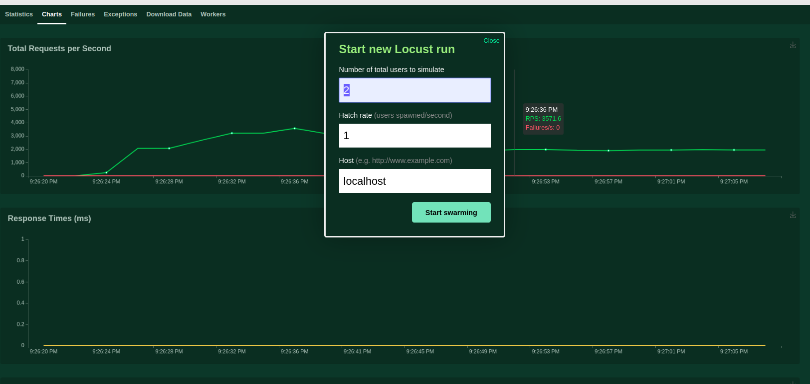

# netest
网络测试工具。建立该框架的目的是为了压测我的毕业设计。本框架需要结合boomer和locust，通过boomer发送测试内容，而locust主要实现图形化。

## 使用方式
* locust和boomer
  
    [locust](locust.io)是一个压测框架，可以自己写代码实现具体的压测内容，其是通过Python实现的，效率相对较低。
    
    [boomer](https://github.com/myzhan/boomer)是myzhan开源的一个Golang的压力测试工具包，可以接入到locust中。使用前需要使用`go get github.com/myzhan/boomer`导入到本地仓库。
    
* 运行locust

    locust只需要先启动即可，不需要马上进行测试。
    
    ```bash
    # 可以使用locust/prometheus_exporter.py启动
    locust --master -f [启动py文件]
    ```

* 运行boomer

    ```bash
    # 简单例子
    # build main.og，也就是测试内容
    # *.go 是会引入main.go需要的本package中的包
    go build -o ./build/main main.go *.go
    ./build/main --max-rps 10000
    ```

* 通过locust启动测试

  